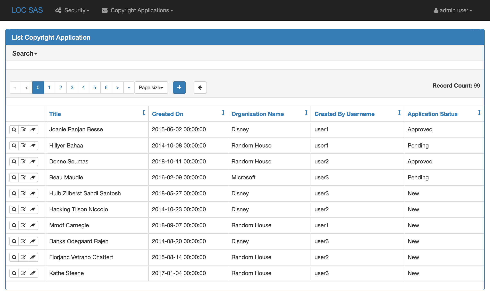
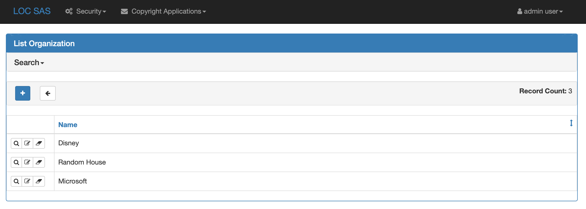
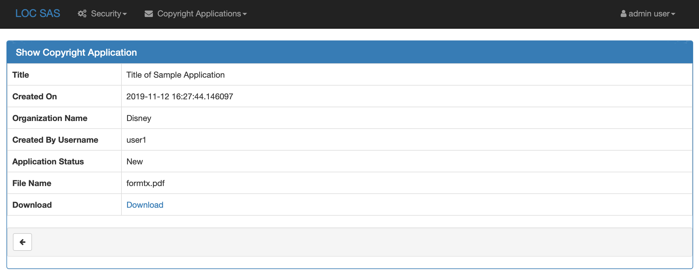
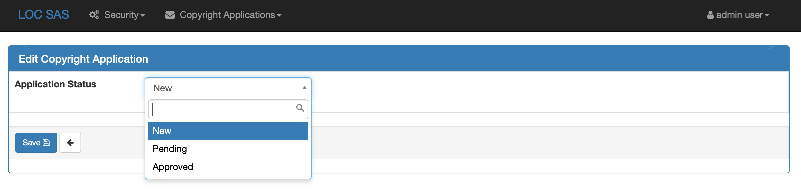
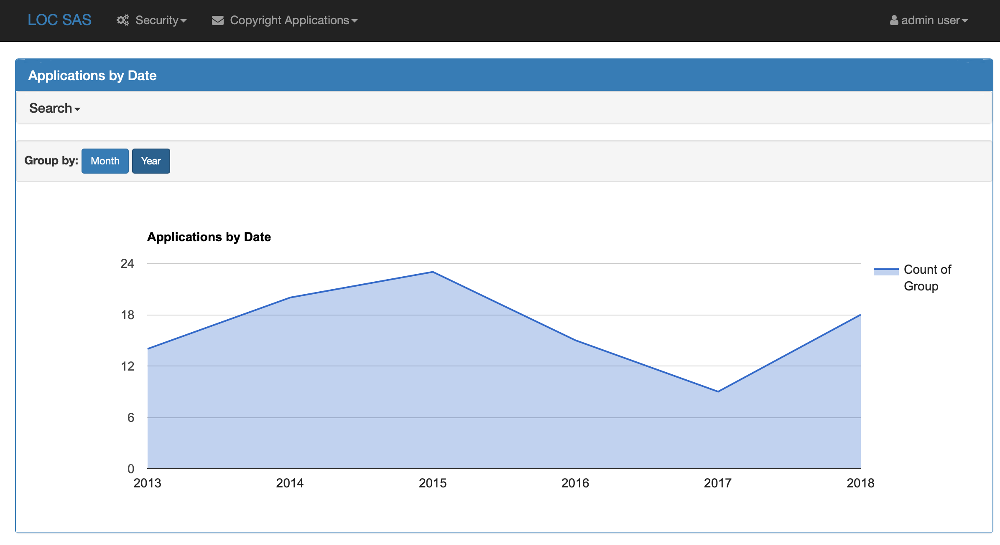
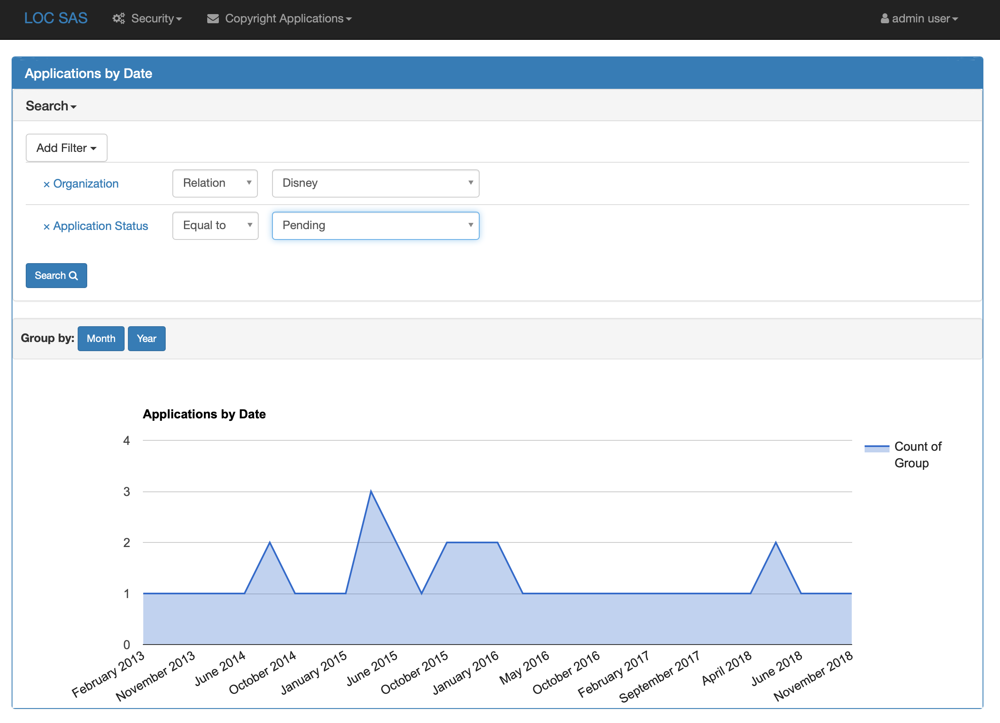
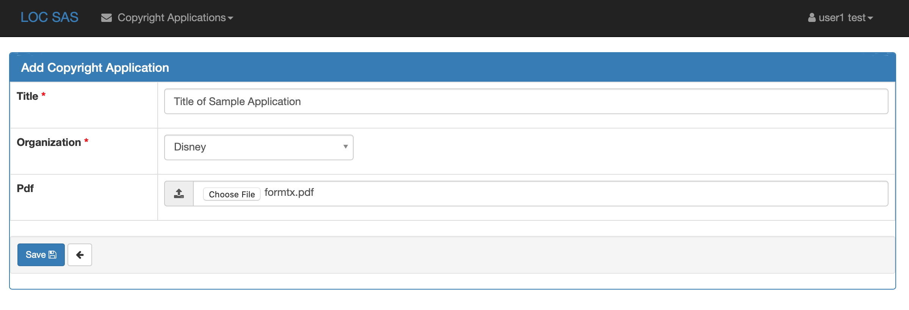
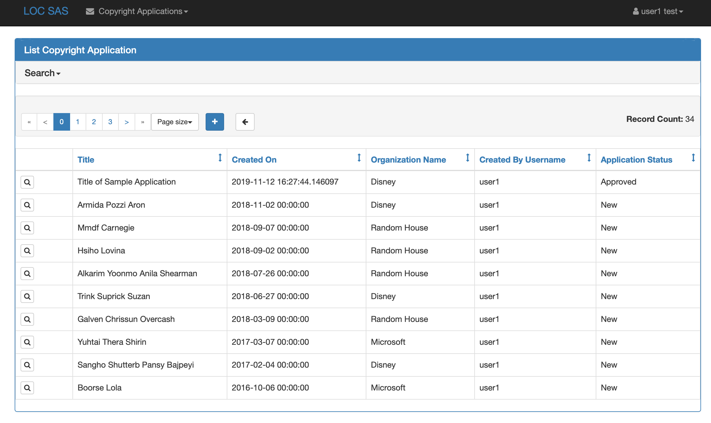

LoC SAS
=================================

This project demonstrates a copyright application portal. Users can submit applications with attachments. Administrators can move the applications through various states and can perform reporting tasks across all applications.

# Installation

### Python

This repository has been built against [Python 3.7](https://www.python.org/downloads/release/python-375/) and Flask.

### Local Development

Set up your virtual environment with all the necessary packages:
```bash
git clone git@github.com:GovWizely/loc-sas.git
cd loc-sas
mkvirtualenv -p /usr/local/bin/python3.7 -r requirements.txt loc-sas
```

### Running locally

These commands will remove any stray local Sqlite database, create some test data and test users, create an admin user, and run the Flask application.
```
rm -f app.db
python testdata.py
flask fab create-admin --username admin --password admin --email admin@example.org --firstname admin --lastname user
FLASK_APP=app/__init__.py FLASK_DEBUG=1 flask run 
```

Open `http://localhost:5000` and log in as `user1`, `user2`, or `user3` with password `password`. Or login with `admin/admin`.

### Testing
To run the whole test-suite along with linting:
```
make test-local
```

To run a single test:
1. Annotate the test with `@pytest.mark.focus`
1. `python -m pytest -s --disable-pytest-warnings -m focus`

### Features

* "Active admin"-like functionality around a basic copyright application (name, title, date, PDF upload)
* DB-backed security for admin role and user role
* Admin user sees all applications, can visualize usage, and can "approve" applications 
* Users only see their own applications, and cannot edit or delete them once they are created

#### Admin User Screenshots

List All Applications

List All Organizations

Show Application and Download PDF Attachment

Changing Application State

View Applications by Year

View Applications by Month with Filters


#### Applicant Screenshots

Create Application

User1's Applications

