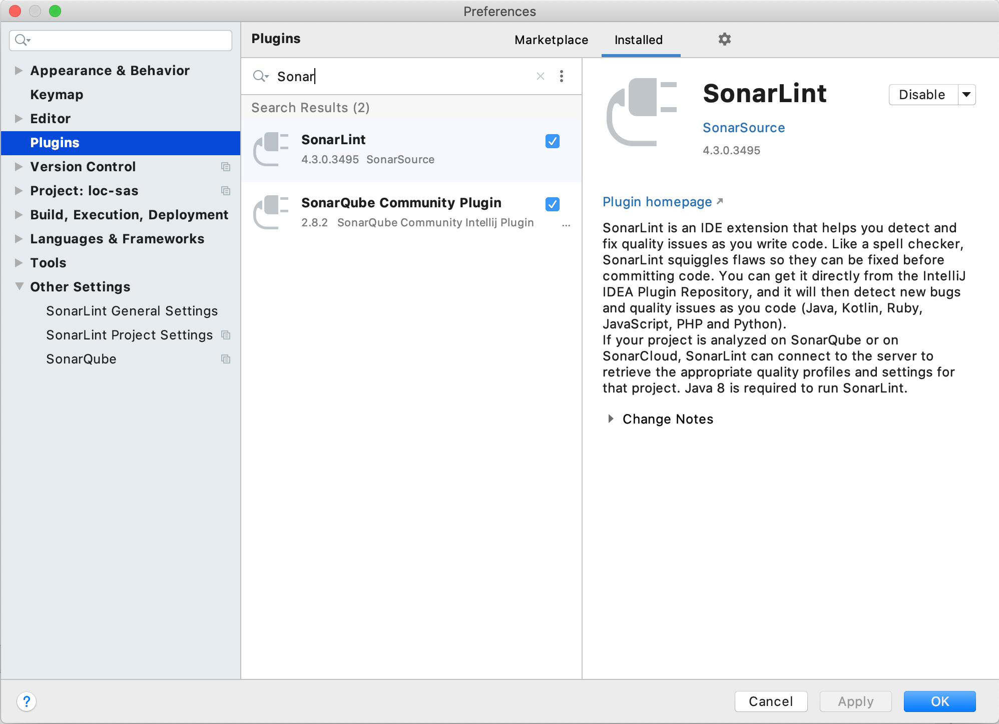
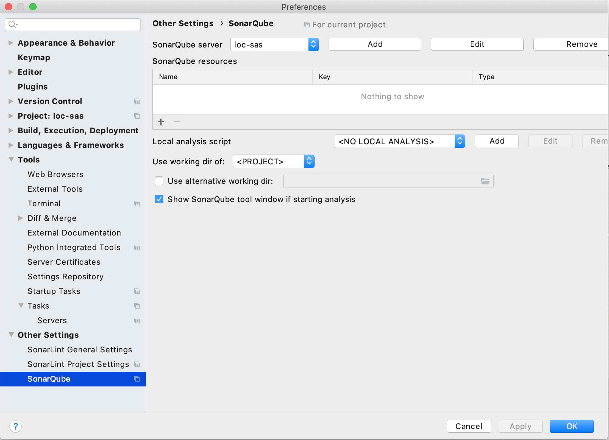
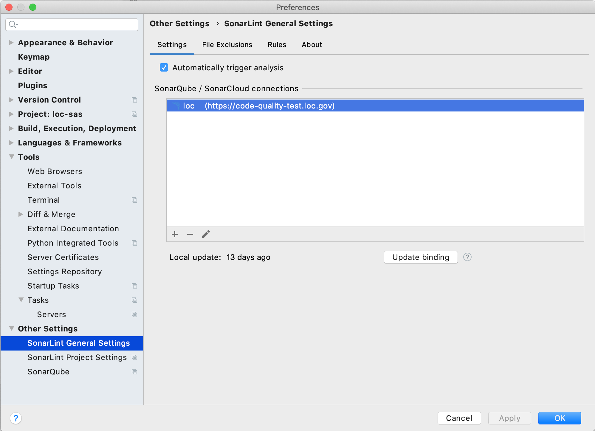
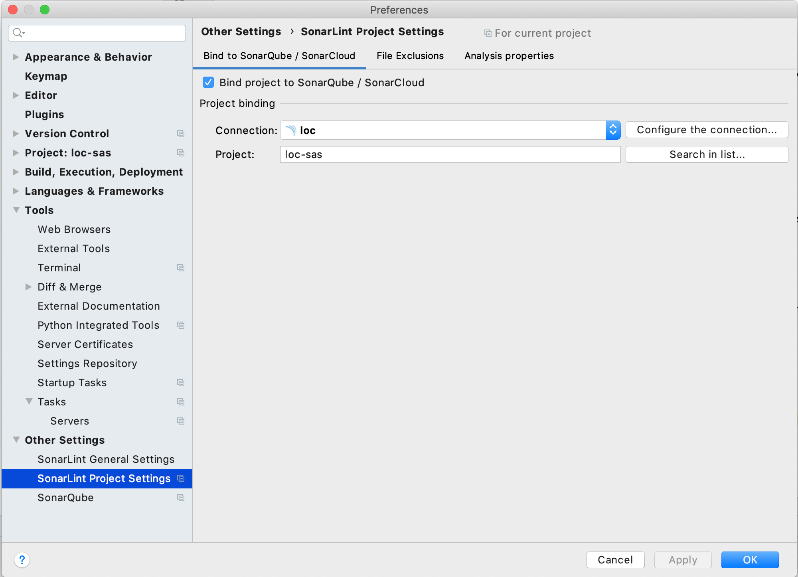
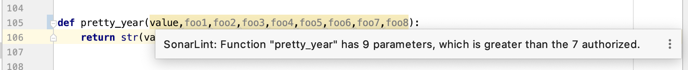

[](https://circleci.com/gh/GovWizely/loc-sas)

LoC SAS
=================================

This project demonstrates a copyright application portal. Users can submit applications with attachments. Administrators can move the applications through various states and can perform reporting tasks across all applications.

# Installation

### Dependencies

 - This project is built on [Flask-AppBuilder](https://github.com/dpgaspar/Flask-AppBuilder) and tested against Python 3.6+ in [CircleCI](https://app.circleci.com/github/GovWizely/loc-sas/pipelines).
 - The frontend utilizes Vue JS; NPM is required to build and run it [Install NPM](https://www.npmjs.com/get-npm)

### Local Development

Set up your virtual environment with all the necessary packages:
```bash
git clone git@github.com:GovWizely/loc-sas.git
cd loc-sas
mkvirtualenv -p /usr/local/bin/python3.7 -r requirements.txt loc-sas
```

If you are using PyCharm, make sure you enable code compatibility inspections for Python 3.6/3.7/3.8.

### Running locally
***Backend***

These commands will remove any stray local Sqlite database, create some test data and test users, create an admin user, and run the Flask application.
```
rm -f app.db
python testdata.py
flask fab create-admin --username admin --password admin --email admin@example.org --firstname admin --lastname user
FLASK_APP=app/__init__.py FLASK_DEBUG=1 flask run 
```

Open `http://localhost:5000` and log in as `user1`, `user2`, or `user3` with password `password`. Or login with `admin/admin`.

***Frontend***
```
cd client 
npm install
npm run serve
```

To build the frontend into the flask server for production: 
```
cd ..
./build-client.sh
```

### Testing
***Backend***

To run the backend test-suite along with linting:
```
make test-local
```

To run a single test:
1. Annotate the test with `@pytest.mark.focus`
1. `python -m pytest -s --disable-pytest-warnings -m focus`

***Frontend***

To run the frontend test-suite:
```
cd client 
npm test
```

***SonarQube***

You can run LoC's SonarQube analysis locally against your current feature branch.

[Download the sonar scanner](https://docs.sonarqube.org/latest/analysis/scan/sonarscanner/) for your development environment OS.

Set up this environment variable based on where you installed the scanner:
```
export SONAR_SCANNER=/Users/loren/Downloads/sonar-scanner-4.2.0.1873-macosx/bin/sonar-scanner
```

Ensure your LoC VPN is enabled.

Generate the test results in the Cobertura format that SonarQube requires and send the results in to the scanner:

```
make sonarqube
```

PyCharm users can integrate the SonarLint plugin and tie it into the LoC's SonarQube server to apply this project's Quality Profiles during development.

First, ensure your LoC VPN is enabled. In PyCharm, download and install the SonarQube Community Intellij Plugin and the SonarLint Plugin. You'll need to restart PyCharm afterwards.



Create the SonarQube Server connection:
 


Configure the SonarLint plugin for PyCharm:


Configure the SonarLint plugin for this project:


Here is an example of what the integration looks like in PyCharm:


### Features

* "Active admin"-like functionality around a basic copyright application (name, title, date, PDF upload)
* DB-backed security for admin role and user role
* Admin user sees all applications, can visualize usage, and can "approve" applications 
* Users only see their own applications, and cannot edit or delete them once they are created

#### Admin User Screenshots

List All Applications

Show Application and Download PDF Attachment

Changing Application State

View Applications by Year

View Applications by Month with Filters


#### Applicant Screenshots

Create Application

User1's Applications

